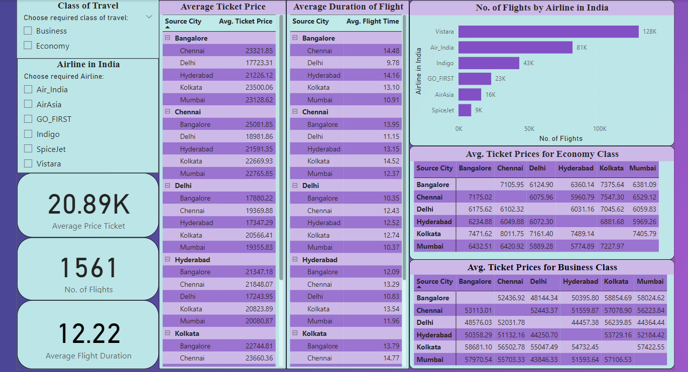

# 🛫 Airlines Ticket Price Analysis — Python + Power BI

### 📊 End-to-End Data Analytics & Visualization Project

This project focuses on analyzing **Indian domestic airline ticket prices** to uncover key **pricing trends, seasonal patterns, and airline performance insights**.  
It combines **Python-based exploratory data analysis (EDA)** with an **interactive Power BI dashboard**, demonstrating the full data analytics lifecycle — from data cleaning to actionable business insights.

---

## 🚀 Project Overview

Airline ticket pricing in India fluctuates dynamically based on routes, seasons, airlines, and travel classes.  
Through this project, we aim to:

- Analyze **ticket pricing patterns** across airlines, routes, and classes.
- Understand **seasonal trends** affecting airfare pricing.
- Visualize **KPIs and insights** through a Power BI dashboard.
- Demonstrate **data storytelling and decision support** using analytics.

---

## 🧠 Objectives

- Perform data cleaning and exploratory data analysis using **Python**.  
- Create an interactive **Power BI dashboard** for visual storytelling.  
- Identify **key business insights** like:
  - Which airline offers the best price-value balance?
  - How do prices vary across routes and seasons?
  - Which travel class contributes most to revenue?

---

## 🧰 Tools & Technologies

| Category | Tools |
|-----------|-------|
| **Data Analysis** | Python (Pandas, NumPy, Matplotlib, Seaborn) |
| **Visualization** | Power BI |
| **Data Source** | Indian airline ticket dataset (domestic routes) |
| **Reporting** | Power BI dashboard (`Indian Airline Ticket Prices Dashboard.pbix`) |
| **Environment** | Jupyter Notebook (`India Airlines Ticket Price Exploratory Analysis.ipynb`) |

---

---

## 🧾 Steps Performed

### 1️⃣ Data Preprocessing (Python)
- Loaded and cleaned airline ticket dataset.
- Handled missing values, formatted dates, and standardized airline names.
- Derived new metrics (price per km, seasonal index, etc.).
- Conducted univariate and bivariate analysis using **matplotlib** and **seaborn**.

### 2️⃣ Exploratory Analysis
- Identified **most expensive routes** and **airlines with competitive pricing**.
- Analyzed **fare variation** by **class**, **duration**, and **season**.
- Discovered **seasonal peaks** in airfare pricing.

### 3️⃣ Power BI Dashboard Development
- Imported the cleaned dataset into **Power BI**.
- Designed visuals for:
  - Average fare by airline  
  - Price distribution by route and class  
  - Monthly/seasonal trend analysis  
  - KPIs for total flights, average fare, and class contribution
- Added slicers for **airline**, **route**, and **month** for interactivity.

---

## 📸 Dashboard Preview

> *Interactive Power BI dashboard visualizing key insights into airline pricing, routes, and seasonal demand.*

---

## 📈 Key Insights

- ✈️ **Airlines with higher frequency routes** often maintain lower average fares.  
- 💰 **Business class fares** show 3× higher variation than economy, especially in peak seasons.  
- 📅 **December–January** and **May–June** emerge as fare surge periods due to holidays and travel demand.  
- 🌍 **Metro-to-Metro routes** dominate high-revenue segments.

---

## 🧩 Outcomes

- Demonstrated ability to perform **end-to-end analytics** — from EDA to BI visualization.  
- Showcased **data storytelling** using KPIs and interactive dashboards.  
- Delivered **actionable insights** for pricing strategy and customer segmentation.

---

## 🔗 Links

- 📂 **Power BI Dashboard:** `Indian Airline Ticket Prices Dashboard.pbix`  
- 📒 **Python Notebook (EDA):** `India Airlines Ticket Price Exploratory Analysis.ipynb`  
- 🖼️ **Dashboard Image:** `dashboard.png`

---

## 👨‍💻 Author

**Sarvagya Tiwari**  
B.Tech, Electronics and Communication Engineering  
Indian Institute of Technology (ISM) Dhanbad  
🔗 [LinkedIn](https://www.linkedin.com/in/sarvagya1201) | [GitHub](https://github.com/sarvagya1201)

---

## 📂 Project Structure

